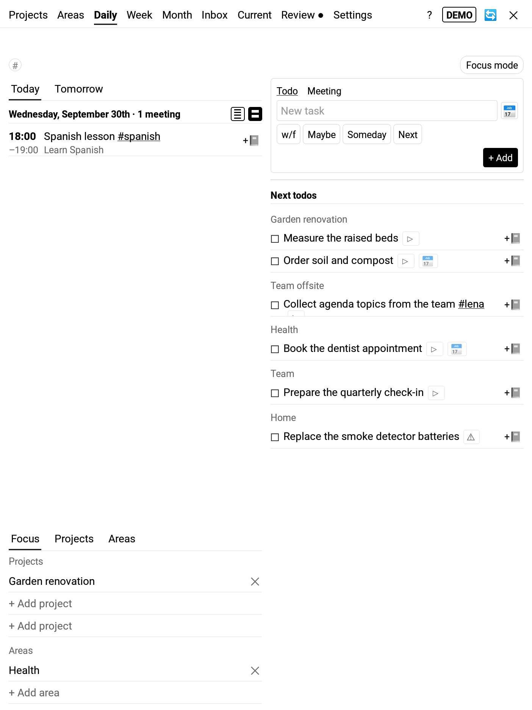
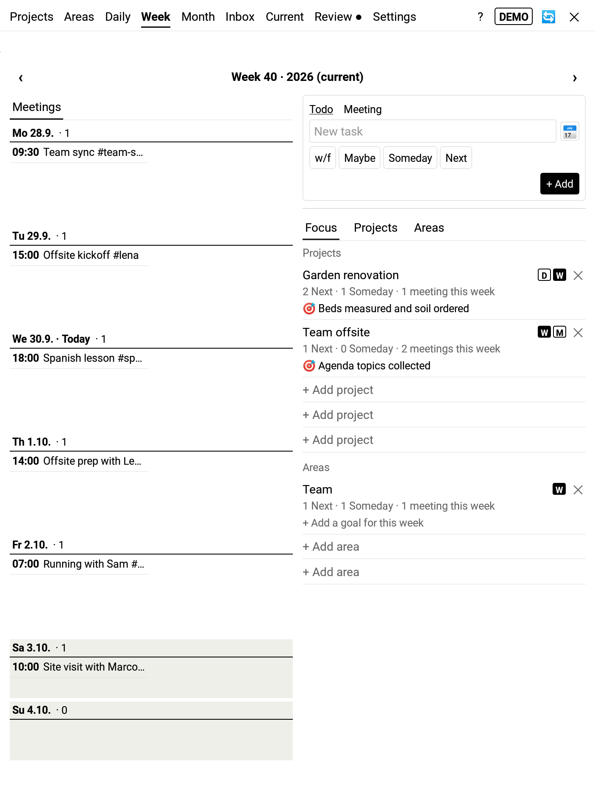
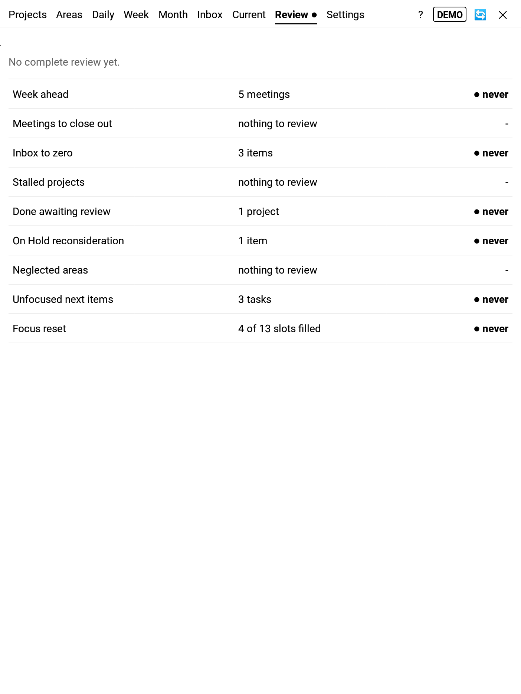

# gtdpara

**A calm GTD + PARA workspace for the Supernote.** Tasks, meetings and notes are filed as plain
text in your own Projects / Areas / Resources / Archive folders, so you can read and edit them
anywhere, with or without the plugin.

> Status: hobby project, first public release (0.1.0). Expect rough edges.
> Issues and ideas are welcome.

<table>
<tr><td align="center"> Daily</td><td align="center"> Week</td><td align="center"> A project (Current tab)</td></tr>
<tr><td align="center"> Inbox and Quick Add</td><td align="center"> Weekly Review</td><td align="center"> In-app help</td></tr>
</table>

Screenshots from the built-in demo space on a Supernote A5 X.

## Why gtdpara

- **Your files, no lock-in.** Every Project and Area is a folder. Its todos and meetings live
  in a small plain-text file inside it (`project.txt` / `area.txt`). Any text editor can open it,
  and if you stop using gtdpara, your folders, notes and lists are still there.
- **Calm and made for e-ink.** Only what matters today on Daily, only your `#now` todos in focus
  mode. Screens are paged instead of scrolled; no notifications, no timers, no streaks.
- **Built on what the Supernote already does.** Handwritten notes for todos and meetings,
  backgrounds from your own templates, keywords for the Supernote's keyword search, links to
  notes and files, and the lasso to turn handwriting into a todo or meeting.
- **The whole life of a project.** Create it, work through it, mark it done, then close it out:
  check nothing is left open, move results to the area or Resources, and turn all its notes into
  one PDF with a table of contents - a record you can keep and read away from the Supernote.
  Then it moves into the Archive, sorted by year.
- **Keep your word clean.** Inspired by Werner Erhard's and Michael Jensen's work on integrity,
  in particular [Creating Leaders: An Ontological/Phenomenological Model](https://papers.ssrn.com/abstract=1681682)
  (with Kari Granger) and its four foundations of being a leader: integrity, authenticity, being
  committed to something bigger than oneself, and being cause in the matter. Say clearly what
  you are on the hook for, then keep it or consciously renegotiate it. `#next`, focus and `#now`
  exist to make that visible, not to pile up more to do.
- **Room for rest.** Nothing auto-suggests the next task. The gap after finishing something is
  yours.

More in [Why gtdpara works this way](docs/user/philosophy.md).

## Features at a glance

- **Daily, Week and Month** views with meetings, due todos and next actions from what you focus on
- **Focus mode** (`#now`): only the few things you are doing right now
- **Quick Add** for todos, meetings and notes, with tags, due dates and refiling
- **Projects & Areas** with status, scope, abbreviations and linked files
- **Inbox + lasso capture** from handwriting, or **Mark for later** in one tap and process the marks later
- **Weekly Review** hub with one clear step at a time
- **Threads**: tap a nested tag like `#retro/alpha` for everything around a person, team or meeting
  series - next meetings, what you owe, what you wait for, what is relevant, what was agreed in
  past meetings and what got done since
- Works with **Obsidian** (Tasks and Dataview) through the Supernote Cloud Sync plugin
- **Note templates** (Tag Rules): new notes come with a background and pre-filled context; shared
  notes can be split by tag, nested tag and date, e.g. one file per coaching client and year
- **Project close-out**: a short wizard before archiving, with an optional PDF of all notes
- Experimental **Google Calendar** (ICS link) and **Gmail** (IMAP, in the Weekly Review) integrations

The **[user guide](docs/user/index.md)** explains every view and setting, and the ideas behind
them. The same pages are built into the plugin: tap **?** in the tab bar. See [CHANGELOG.md](CHANGELOG.md)
for what changed in each version, including which features are still experimental.

## Install

1. Download the latest `gtdpara-x.y.z.snplg` from
   [Releases](https://github.com/tilmanbergt/gtdpara/releases/latest).
2. Copy it to your Supernote and install it as a plugin (requires a firmware with plugin support).
3. Open gtdpara from the plugin sidebar in a note, then check **Settings → Folders**.

Updating: install the newer `.snplg` over the existing one. Read the *Upgrade notes* in the
changelog first.

## Help and bug reports

- Questions and ideas: [GitHub Discussions](https://github.com/tilmanbergt/gtdpara/discussions)
- Bugs: [open an issue](https://github.com/tilmanbergt/gtdpara/issues/new/choose) and include
  the version from Settings → About
- Contributing: see [CONTRIBUTING.md](CONTRIBUTING.md)
- Privacy and network access: see [PRIVACY.md](PRIVACY.md)

## For developers

Architecture, design documents and build instructions are in [docs/dev/](docs/dev/README.md).

## License

[MIT](LICENSE) © 2026 Tilman Bergt. Built with React Native and Ratta's `sn-plugin-lib`.
gtdpara is an independent project and not affiliated with Ratta or Supernote.
